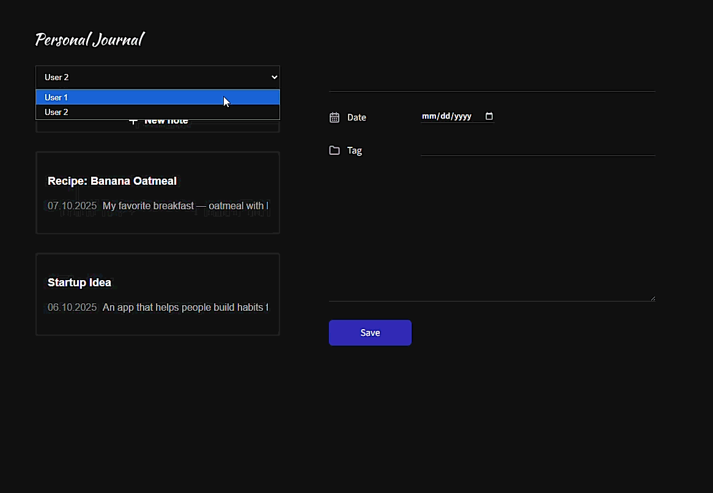
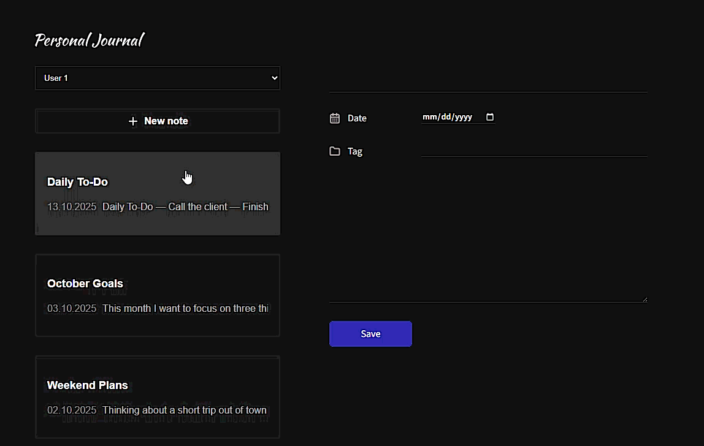
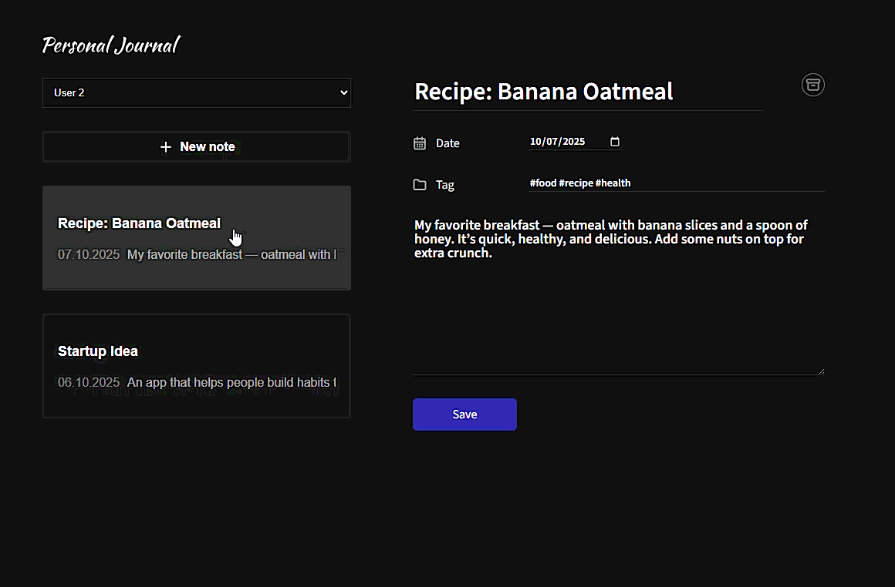
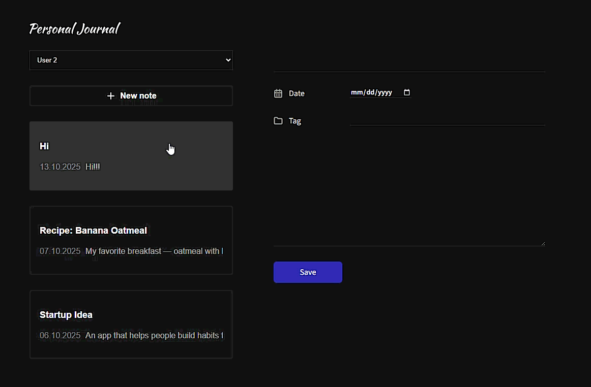

# React Note-Taking App

A simple and interactive note-taking application built with React. Users can add, edit, and delete notes, with data stored in the browser's LocalStorage. Notes are sorted by newest first, so the most recent notes appear at the top. The app features a responsive design and uses React Hooks for state management.


## 🚀 Demo

**Live Demo:** [GitHub Pages](https://alexandrashuyanova.github.io/MyJournal/)

Below are short GIF previews of key features of the app 👇

### 🧍‍♂️ Switch Between Users

Easily switch between different users using React Context. Each user has their own set of notes stored in LocalStorage.



### ✏️ Edit Existing Note

Open an existing note, make changes, and save — updates appear instantly thanks to React Hooks and LocalStorage.



### ➕ Add New Note

When you click **“Add Note”**, all fields are cleared (even if another note was selected), allowing you to start fresh and add a new note. The form state is managed using `useReducer`, making it easier to handle complex form logic. Newly added notes appear at the top of the list.



### 🗑️ Delete Note

Remove any note instantly. The note list updates automatically, and data persists correctly in LocalStorage.



---

## ✨ Features

- ➕ Add, edit, and delete notes  
- 🧍‍♂️ Switch between different users (via React Context)  
- 💾 Notes are saved in LocalStorage for persistence  
- 📄 Notes are sorted by newest first (most recent notes appear at the top)  
- 📱 Responsive design for mobile and desktop  
- ✏️ Form validation: required fields (title, text, date) are highlighted if empty, and focus moves to the first missing field (implemented using `useRef`)  
- ⚛️ Utilizes React Hooks:
  - `useState`, `useEffect`, `useRef`, `useMemo`, `useCallback`, `useContext`, `useReducer`

---

## 🛠️ Technologies

- React
- React Context API (`createContext`, `useContext`)
- JavaScript (ES6+)
- LocalStorage
- CSS / Styled Components
- GitHub Pages (hosting)

---

## ⚛️ Hooks Used

- `useState` – for component state management  
- `useEffect` – for side effects and data persistence  
- `useRef` – for accessing DOM elements and storing mutable values  
- `useMemo` – for memoizing expensive calculations  
- `useCallback` – for memoizing functions  
- `useContext` – for global state (user switching)  
- `useReducer` – specifically for managing form state logic (Add/Edit Note form)

---

## 💡 Why I Built This Project

I created this project to improve my skills in React and deepen my understanding of state management using Hooks and Context. Working on this app allowed me to experiment with:

- Creating reusable and custom Hooks
- Managing global state with React Context (user switching functionality)
- Persisting data in LocalStorage
- Building a responsive and user-friendly interface
- Structuring a project independently from start to finish

This project also helped me gain confidence in showcasing my work publicly and preparing for real-world development scenarios.

---

## ⚙️ Installation

1. ***Clone the repository***
```bash
git clone https://github.com/AlexandraShuyanova/MyJournal.git
```

2. ***Install dependencies***
```bash
npm install
```

3. ***Start the development server***
```bash
npm start
```

## 📚 Learnings & Personal Contribution

- Developed strong skills in React Hooks and custom hooks

- Learned to manage global state using React Context (createContext, useContext)

- Learned to persist data using LocalStorage

- Built a responsive and user-friendly interface

- Improved project organization and self-management skills

---

## 🔗 Links

- 🌐 **Live Demo:** [GitHub Pages](https://alexandrashuyanova.github.io/MyJournal/)

- 💻 **Source Code:** [GitHub Repository] (https://github.com/AlexandraShuyanova/MyJournal)


